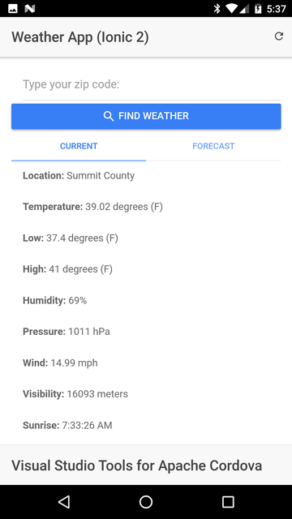
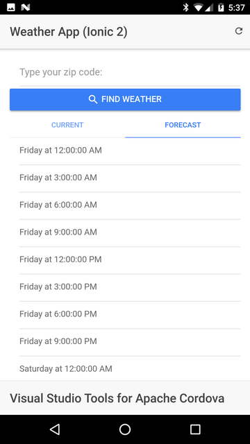
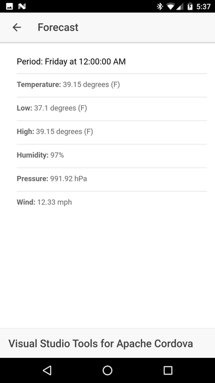

# TACO Weather App, Ionic 2

This is an Ionic 2 version of the [TACO Weather App](http://taco.visualstudio.com/en-us/docs/vs-taco-2017-first-app/) solution. The mobile application uses the [Open Weather Map](http://openweathermap.org/) service to provide current weather conditions and a 5 day forecast.

## Using the Project
 
The project included in this repository was created using Visual Studio 2015 and the Visual Studio Tools for Apache Cordova (TACO). To open the project, be sure you have a functional installation of Visual Studio 2015 plus TACO. For instructions on how to install Visual Studio and TACO, refer to [*Install Visual Studio Tools for Apache Cordova*](http://taco.visualstudio.com/en-us/docs/install-vs-tools-apache-cordova/).

Start Visual Studio 2015, then select **File** -> **Open** -> **Project/Solution**. In the dialog that appears, navigate to the folder where you copied this repository and open the `WeatherAppIonic2-2015.sln` file. When the project opens, use the code editing capabilities to study and tweak the project's code. Use TACO to run and debug the application on a device, a device emulator or simulator, or in the browser using Ripple. Fro information on these options, refer to articles in the **Build & Deploy** section of the [*Visual Studio Tools for Apache Cordova*](http://taco.visualstudio.com/en-us/docs/install-vs-tools-apache-cordova/) web site.

## Application Operation
On start up, the application uses the Apache Cordova Geolocation plugin to determine the current location for the device running the application, then loads the weather conditions for that location. The application's main UI is split using an Ionic Segment (`ion-segment` control); the **Current** segment shows current weather conditions while the **Forecast** segment lists the 5 day forecast for the location. Tap the refresh icon in the upper-right corner of the app's UI to refresh the weather data for the current location.

When a user enters a US Zip Code, the application will retrieve current weather conditions for the specified location.

> **Note:** You can easily convert the app to use city name instead of Zip code. It requires merely changing the endpoint URL for the weather service.  

The following figure shows the contents of the Current segment.

When providing a forecast, the Open Weather API returns an array representing forecast time periods beginning with the following day at midnight (local time). The **Forecast** segment displays an interactive list of the available forecast periods as shown in the following figure: 

Tap on a period to open a page containing the detailed weather forecast for the selected period as shown in the following figure.

## Potential Enhancements

Add an Ionic refresher control (`ion-refresher`) to enable the user to pull down on the page to refresh the data. 
